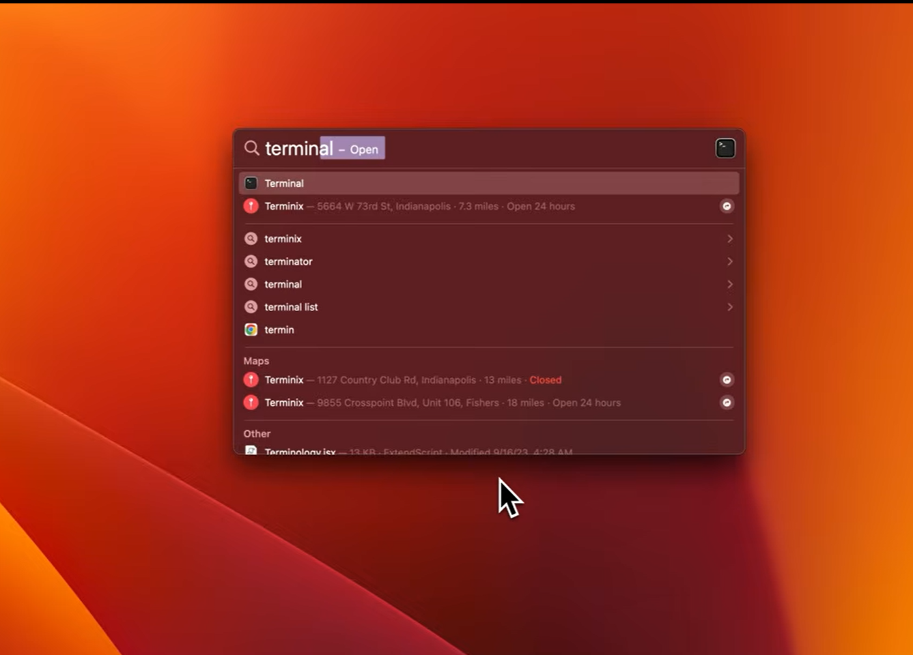

# Materi Lengkap: Git & GitHub
### Komandro 2026 — Basic Bootcamp
## Daftar Isi

0. [Sebelum Mulai: Kenalan Dulu Sama Terminal](#0-sebelum-mulai-kenalan-dulu-sama-terminal)
1. [Pengantar: Apa itu Git & GitHub](#1-pengantar-apa-itu-git--github)
2. [Kenapa Version Control Itu Penting](#2-kenapa-version-control-itu-penting)
3. [Instalasi & Konfigurasi Awal](#3-instalasi--konfigurasi-awal)
4. [Konsep Dasar yang Wajib Dipahami](#4-konsep-dasar-yang-wajib-dipahami)
5. [Membuat & Menghubungkan Repository](#5-membuat--menghubungkan-repository)
6. [Alur Kerja Dasar: Add, Commit, Push](#6-alur-kerja-dasar-add-commit-push)
7. [Branching: Kerja Paralel Tanpa Saling Ganggu](#7-branching-kerja-paralel-tanpa-saling-ganggu)
8. [Pull Request & Code Review](#8-pull-request--code-review)
9. [Menangani Konflik (Merge Conflict)](#9-menangani-konflik-merge-conflict)
10. [Fitur-Fitur Penting GitHub](#10-fitur-fitur-penting-github)
11. [Studi Kasus: Simulasi Kerja Tim](#11-studi-kasus-simulasi-kerja-tim)
12. [Kesalahan Umum & Cara Mengatasinya](#12-kesalahan-umum--cara-mengatasinya)
13. [Cheat Sheet Perintah](#13-cheat-sheet-perintah)
14. [Glosarium](#14-glosarium)

---

## 0. Sebelum Mulai: Kenalan Dulu Sama Terminal

Sebelum ngomongin Git sama sekali, kita kenalan dulu sama satu aplikasi yang akan sering banget dipakai: **Terminal**.

### 0.1 Terminal itu Apa?

Terminal adalah **aplikasi** di komputer kamu — sama seperti Microsoft Word atau Chrome itu aplikasi. Bedanya, kalau Word/Chrome kamu pakai dengan klik-klik tombol dan menu, Terminal kamu pakai dengan **mengetik perintah**.

Tampilannya biasanya kotak hitam (atau putih, tergantung pengaturan) yang isinya cuma tulisan, tanpa tombol, tanpa menu, tanpa gambar.

`[GAMBAR: tampilan jendela Terminal kosong yang baru dibuka, dengan panah menunjuk ke titik kedip (cursor) tempat mengetik]`

Jangan takut — ini bukan "hacker mode" yang berbahaya. Ini cuma cara lain buat ngasih perintah ke komputer, selain klik mouse.

### 0.2 Cara Membuka Terminal

**Kalau kamu pakai Windows:**
1. Klik tombol **Start** (logo Windows di pojok kiri bawah layar)
2. Ketik `Command Prompt` atau `cmd`
3. Klik hasil pencarian yang muncul

`[GAMBAR: Start Menu Windows dengan kotak pencarian terisi "cmd", hasil pencarian "Command Prompt" disorot]`

**Kalau kamu pakai Mac:**
1. Klik ikon kaca pembesar (Spotlight Search) di pojok kanan atas layar, atau tekan tombol `Command` + `Spasi` bersamaan
2. Ketik `Terminal`
3. Tekan `Enter`



Setelah terbuka, akan muncul jendela dengan tulisan-tulisan dan sebuah titik kedip (disebut **cursor**) — di titik itulah kamu mengetik.

### 0.3 Cara Pakai Terminal (Aturan Paling Dasar)

1. **Klik satu kali di dalam jendela Terminal** sebelum mulai mengetik — ini memastikan Terminal "mendengarkan" apa yang kamu ketik.
2. Ketik perintahnya (nanti kita akan belajar perintah-perintah yang dipakai untuk Git).
3. Setelah selesai mengetik satu perintah, **tekan tombol `Enter`** untuk menjalankannya. Ini beda dari mengetik di Word — di Terminal, perintah baru "jalan" setelah kamu tekan `Enter`.
4. Terminal akan menampilkan hasilnya di bawah perintah yang kamu ketik tadi.

`[GAMBAR: contoh ketik "git --version" di Terminal, lalu hasil setelah Enter ditekan, dengan anotasi panah "1. ketik di sini" dan "2. tekan Enter"]`

### 0.4 "Kalau Aku Ketik Salah Gimana?"

Tenang, gak akan merusak apa-apa. Kalau perintah yang kamu ketik salah/tidak dikenali, Terminal cuma akan menampilkan pesan error (biasanya diawali `command not found` atau semacamnya) — itu artinya cuma "perintahnya gak dikenali", bukan komputer kamu rusak. Cukup ketik ulang perintah yang benar.

---

## 1. Pengantar: Apa itu Git & GitHub

### 1.1 Git

Git adalah **program di komputer kamu** (aplikasi lain, sama seperti Terminal) yang tugasnya **mencatat setiap perubahan** yang kamu buat pada file-file kerjaan kamu — kapan diubah, dan apa yang diubah.

Bayangkan kamu sedang menulis tugas kuliah. Tanpa Git, biasanya orang menyimpan file dengan nama seperti:

```
tugas_final.docx
tugas_final_revisi.docx
tugas_final_revisi2_FIX.docx
tugas_final_revisi2_FIX_beneran.docx
```

Ini berantakan dan gampang salah pakai versi. Git menggantikan cara ini: kamu tetap punya **satu file**, tapi setiap perubahannya otomatis "tercatat" di belakang layar, dan kamu bisa lihat atau kembali ke versi manapun kapan saja — tanpa perlu bikin banyak salinan file dengan nama berbeda-beda.

Git diciptakan oleh **Linus Torvalds** (pencipta sistem operasi Linux) pada tahun **2005**.

### 1.2 GitHub

Kalau Git adalah program yang **jalan di komputer kamu sendiri**, GitHub adalah **website** ([github.com](https://github.com)) tempat kamu meng-upload hasil kerja Git tadi, supaya bisa dilihat, disimpan sebagai cadangan online, dan dikerjakan bareng-bareng dengan orang lain dari komputer yang berbeda-beda.

GitHub diluncurkan pada **2008** oleh Tom Preston-Werner dan kawan-kawan.

### 1.3 Perbedaan Git vs GitHub

"Bedanya apa sih bang git sama github?"

simpelnya : **Git = alat yang jalan di laptop kamu. GitHub = tempat online buat naruh dan berbagi hasil kerja alat itu.**

| | Git | GitHub |
|---|---|---|
| **Apa sebenarnya** | Program di komputer kamu (dipakai lewat Terminal) | Website (dibuka lewat browser seperti Chrome) |
| **Di mana jalan** | Di laptop/komputer kamu, tidak butuh internet | Di internet, butuh koneksi untuk diakses |
| **Fungsi inti** | Mencatat riwayat perubahan file di komputer kamu | Menyimpan riwayat itu secara online + tempat kerja bareng orang lain |
| **Analogi paling sederhana** | Seperti aplikasi "Kamera" yang bisa ambil foto (snapshot) kondisi filemu | Seperti "Google Drive/Album" tempat naruh foto-foto itu supaya bisa dilihat orang lain |

---

## 2. Kenapa Version Control Itu Penting

Sebelum masuk ke teknis, penting paham dulu **masalah apa** yang diselesaikan Git:

1. **Riwayat perubahan tersimpan otomatis.** Kamu bisa lihat "file ini dulu kayak apa sebelum diubah", dan kembali ke versi lama kalau perlu.
2. **Kerja bareng tanpa saling tindih.** Tanpa Git, kalau dua orang edit file yang sama lalu saling kirim lewat WhatsApp, pasti ada yang ketimpa/hilang. Git punya cara menggabungkan perubahan dari banyak orang dengan aman.
3. **Eksperimen tanpa takut merusak yang sudah jalan.** Lewat *branching* (bagian 7), kamu bisa coba hal baru di "cabang" terpisah tanpa mengganggu kode utama yang sudah stabil.
4. **Standar industri.** Hampir semua perusahaan software, komunitas open source, dan kompetisi (termasuk CBL) menggunakan Git & GitHub sebagai cara kerja standar.

---

## 3. Instalasi & Konfigurasi Awal

### 3.1 Install Git

1. Buka browser favorit atau yang tersedia di laptop kamu (Chrome, Edge, Firefox, Safari/dll), kunjungi [git-scm.com/downloads](https://git-scm.com/downloads)
2. Website akan otomatis mendeteksi sistem operasi kamu (Windows/Mac/Linux), kalo semisal tidak mendeteksi pilih sesuai sistem operasi yang kamu gunakan — klik tombol download yang muncul
3. Buka file yang sudah terdownload (biasanya ada di folder **Downloads**), lalu install seperti install aplikasi biasa: klik **Next** terus sampai muncul tombol **Install**, lalu **Finish**. Opsi-opsi yang muncul selama instalasi boleh dibiarkan default (tidak perlu diubah-ubah).

`[GAMBAR: halaman git-scm.com/downloads dengan tombol download disorot]`

`[GAMBAR: jendela installer Git di langkah pertama, dengan tombol "Next" disorot]`

### 3.2 Cek Apakah Git Berhasil Terinstall

Buka [**Terminal**](#0-sebelum-mulai-kenalan-dulu-sama-terminal), klik di dalam jendelanya, lalu ketik:

```bash
git --version
```

Tekan `Enter`. Kalau berhasil, akan muncul tulisan seperti `git version 2.43.0` (angkanya boleh beda, yang penting muncul tulisan versi, bukan pesan error).

`[GAMBAR: Terminal menampilkan hasil "git --version" yang berhasil, dengan kotak merah di sekitar tulisan versi Git]`

**Kalau muncul pesan error**

(misal `git is not recognized as an internal or external command, operable program or batch file.`), coba tutup Terminal, buka lagi, lalu ulangi. Kalau masih error, kemungkinan instalasi belum selesai dengan benar — ulangi langkah [3.1.](#31-install-git)

### 3.3 Buat Akun GitHub

1. Buka browser, kunjungi [github.com](https://github.com)
2. Klik tombol **Sign up** (biasanya di pojok kanan atas)
3. Isi email, buat password, pilih username
4. Ikuti instruksi verifikasi yang dikirim ke email kamu

`[GAMBAR: halaman github.com dengan tombol "Sign up" disorot]`

### 3.4 Konfigurasi Identitas Git

Git perlu tahu "siapa kamu" supaya setiap perubahan yang kamu buat tercatat atas nama kamu. Ini **dilakukan sekali saja** di komputer kamu.

Di [**Terminal**](#0-sebelum-mulai-kenalan-dulu-sama-terminal), ketik dua baris ini satu-satu (tekan `Enter` setelah masing-masing baris):

```bash
git config --global user.name "Nama Kamu"
```

```bash
git config --global user.email "email_github_kamu@email.com"
```

Ganti `"Nama Kamu"` dengan nama kamu, dan email dengan email yang sama dengan akun GitHub yang telah kamu buat di Bagian [3.3.](#33-buat-akun-github)

**Cek konfigurasi yang sudah diset:**

```bash
git config --list
```

`[GAMBAR: hasil "git config --list" menampilkan highlight dari user.name dan user.email yang sudah terisi]`

---

## 4. Konsep Dasar yang Wajib Dipahami

Sebelum praktik, pahami dulu istilah-istilah ini. Ini fondasi — kalau bagian ini kelewat, bagian selanjutnya akan terasa membingungkan.

### 4.1 Repository (Repo)

Repository adalah **folder project** yang riwayat perubahannya dilacak oleh Git. Bisa ada di komputer kamu (**local repository** — "lokal" artinya di laptop kamu sendiri) atau di GitHub (**remote repository** — "remote" artinya di server/online).

### 4.2 Commit

Commit adalah **"titik simpan"** dari perubahan yang kamu buat, lengkap dengan catatan singkat penjelasan (*commit message*). Bayangkan commit seperti "save point" di video game — kamu bisa kembali ke titik itu kapan saja.

### 4.3 Branch (Cabang)

Branch adalah **jalur pengembangan terpisah** dari kode utama. Secara default, setiap repo punya branch utama bernama `main`.

Analogi: bayangkan `main` adalah jalan raya utama yang sudah stabil dan dipakai semua orang. Kalau kamu mau coba bikin sesuatu yang baru dan belum tentu berhasil, kamu bikin "jalan cabang" (branch) sendiri dulu — kalau berhasil, baru digabung ke jalan utama. Kalau gagal, cabang itu bisa dibuang tanpa merusak jalan utama.

### 4.4 Merge

Merge adalah proses **menggabungkan** perubahan dari satu branch ke branch lain.

### 4.5 Staging Area

Ini konsep yang sering bikin bingung pemula. Git punya 3 "area" tempat file kamu "berada":

```
Working Directory   →   Staging Area    →   Repository (Commit)
 (file yang lagi          (file yang            (riwayat yang
  kamu edit)           "ditandai" siap         udah permanen
                            disimpan)             tersimpan)
```

- **Working Directory**: folder project kamu, tempat kamu edit file sehari-hari — ini yang kamu lihat di File Explorer/Finder.
- **Staging Area**: area "tunggu" — kamu pilih file mana saja yang mau ikut disimpan lewat perintah `git add`.
- **Repository**: setelah `git commit`, perubahan resmi tersimpan sebagai riwayat permanen.

### 4.6 Remote & Origin

**Remote** adalah alamat repository yang tersimpan online (di GitHub). **Origin** adalah nama panggilan default untuk remote utama kamu, supaya tidak perlu ketik alamat URL panjang setiap kali.

### 4.7 Clone vs Fork

- **Clone**: menyalin repository dari GitHub ke komputer kamu.
- **Fork**: menyalin repository milik orang lain ke akun GitHub kamu sendiri.

---

## 5. Membuat & Menghubungkan Repository

Ada dua skenario umum: **mulai project dari nol**, atau **melanjutkan project yang sudah ada di GitHub**.

### 5.1 Skenario A — Mulai Project Baru dari Komputer Kamu

**Langkah 1:** Di [**Terminal**](#0-sebelum-mulai-kenalan-dulu-sama-terminal), buat folder baru untuk project kamu, lalu masuk ke folder itu:

```bash
mkdir nama-project
cd nama-project
```

Penjelasan: `mkdir` (singkatan dari *make directory*) artinya "buat folder baru". `cd` (singkatan dari *change directory*) artinya "masuk/pindah ke folder tersebut" — ini setara dengan kamu klik dua kali sebuah folder di File Explorer, tapi lewat ketikan.

`[GAMBAR: Terminal setelah mengetik "mkdir nama-project" dan "cd nama-project", menunjukkan nama folder di baris Terminal berubah menandakan sudah "masuk" ke folder itu]`

**Langkah 2:** Jadikan folder ini sebagai repository Git:

```bash
git init
```

Perintah ini membuat folder tersembunyi bernama `.git` di dalam project kamu — di sinilah semua riwayat Git disimpan. Folder ini tersembunyi (tidak akan terlihat di File Explorer/Finder secara normal), dan jangan dihapus.

**Langkah 3:** Buat repository kosong di GitHub lewat browser:
1. Login ke [github.com](https://github.com)
2. Klik tombol hijau **New** atau tanda **+** di pojok kanan atas → **New repository**

`[GAMBAR: halaman utama github menampilkan dimana tombol untuk membuat repository baru]`

3. Untuk sekarang cukup isi nama repository (samakan dengan nama folder kamu biar tidak bingung)
4. **Jangan** centang opsi "Add a README file", "Add .gitignore", atau "Choose a license" atau biarkan default karena kita memulainya dari folder lokal yang sudah ada.
5. Klik **Create repository**

`[GAMBAR: halaman "Create a new repository" di GitHub dengan kolom nama repo dan tombol "Create repository" disorot]`

**Langkah 4:** Setelah dibuat, GitHub akan menampilkan sebuah alamat URL (contoh: `https://github.com/username/nama-project.git`). Salin URL itu, lalu di Terminal ketik:

```bash
git remote add origin [tempel URL kamu di sini]
```

```bash
# Contoh

git remote add origin https://github.com/Jofadlan/belajar-git
```

Cek apakah sudah terhubung dengan benar:

```bash
git remote -v
```

`[GAMBAR: Terminal yang menampilkan hasil dari perintah "git remote add" dan "git remote -v"]`

### 5.2 Skenario B — Melanjutkan Project yang Sudah Ada di GitHub

Kalau repo sudah ada di GitHub (misal punya organisasi Komandro) dan kamu mau mulai kerja dari situ, kamu tinggal **clone** (menyalin) repo itu ke komputer kamu.

1. Buka halaman repo di GitHub, klik tombol hijau **Code**, salin URL yang muncul
2. Di Terminal, ketik:

```bash
git clone [tempel URL yang kamu salin]
```

`[GAMBAR: tombol hijau "Code" di halaman GitHub yang sudah diklik, menampilkan kotak URL untuk disalin]`

Perintah ini otomatis: download semua file + riwayat + langsung terhubung ke remote `origin`. Ini jauh lebih simpel daripada Skenario A.

 Namun, cara `git clone` ini tidak disarankan jika kamu sudah terlanjur memiliki folder berisi file kode di komputermu, karena perintah ini hanya bisa mengunduh folder baru dari awal dan akan menolak masuk ke dalam folder yang sudah ada isinya.

---

## 6. Alur Kerja Dasar: Add, Commit, Push

Ini alur yang akan kamu ulangi **terus-menerus** setiap kali kerja dengan Git. Wajib hafal luar kepala.

```
1. Edit file           (di Working Directory — folder biasa di laptop kamu)
2. git add              (pindahkan ke Staging Area)
3. git commit           (simpan sebagai riwayat)
4. git push              (kirim ke GitHub)
```

### Langkah 1: Cek Status

Sebelum apa-apa, biasakan cek status dulu di Terminal (pastikan kamu masih berada di dalam folder project kamu):

```bash
git status
```

Ini akan menampilkan file mana yang berubah sejak commit terakhir. Jika kamu belum menambahkan atau mengubah apapun di dalam folder yang udah kita buat tadi seharusnya tampilannya akan kosong.

`[GAMBAR: Terminal menampilkan hasil git status tanpa perubahan]`

Nah sekarang coba buat 1 file txt, di [**Terminal**](#0-sebelum-mulai-kenalan-dulu-sama-terminal) ketik:

```bash
echo "Halo Dunia" > readme.md
```

Setelah itu coba ketik `git status` lagi, seharusnya sekarang ada file bernama `readme.md` yang telah kita buat tadi.

`[GAMBAR: hasil "git status" menunjukkan file yang berubah berwarna merah (belum di-add)]`

### Langkah 2: `git add` — Menandai File Siap Disimpan

```bash
git add nama_file.txt        # tambah satu file spesifik
git add .                    # tambah SEMUA file yang berubah (titik artinya "semua")
```

Setelah `git add`, jalankan `git status` lagi — file yang tadi merah akan berubah jadi hijau, menandakan sudah masuk Staging Area.

`[GAMBAR: hasil "git status" setelah git add, file berubah warna jadi hijau]`

### Langkah 3: `git commit` — Menyimpan Perubahan

```bash
git commit -m "First Commit"
```

`-m` diikuti pesan singkat yang menjelaskan **apa** yang diubah, ditulis di antara tanda kutip dua.

**Contoh commit message yang baik vs kurang jelas:**

| ✅ Jelas | ❌ Kurang jelas |
|---|---|
| `fix: perbaiki tombol submit yang tidak berfungsi` | `update` |
| `feat: tambahkan validasi form pendaftaran` | `asdasd` |
| `docs: perbarui panduan instalasi di README` | `fix lagi` |

### Langkah 4: `git push` — Mengirim ke GitHub

```bash
git push origin main
```

Ini mengirim semua commit yang belum ter-upload ke branch `main` di GitHub.

**Untuk push pertama kali**, biasanya dipakai:

```bash
git push -u origin main
```

Setelah ini, kamu bisa cek hasilnya dengan membuka halaman repo kamu di GitHub lewat browser — file yang kamu push akan muncul di sana.

`[GAMBAR: halaman repo GitHub menampilkan file yang baru saja di-push, dengan commit message terakhir terlihat]`

### Langkah 5 (kalau kerja tim): `git pull`

Sebelum mulai kerja, tarik dulu perubahan terbaru dari GitHub:

```bash
git pull origin main
```

Ini akan mengambil riwayat commit terbaru dari repository remote yang sudah kita hubungkan tadi dan langsung menggabungkannya (`merge`) ke dalam `branch` lokal di komputermu secara otomatis. Perintah ini menggabungkan fungsi `git fetch` dan `git merge` agar file projek di laptopmu selalu sinkron dengan kode paling update yang dikerjakan oleh tim. Sangat disarankan untuk menjalankannya setiap kali sebelum kamu mulai menulis kode baru demi mencegah terjadinya bentrokan atau konflik kode (`merge conflict`).

---

## 7. Branching: Kerja Paralel Tanpa Saling Ganggu

### 7.1 Kenapa Perlu Branch?

Bayangin skenario ini: kamu lagi kerja bareng temenmu di 1 repo yang sama untuk tugas kelompok. Repo itu isinya website yang **sudah jadi dan sudah bagus** — ini yang dinamain `main`, versi "resmi" yang boleh dilihat dosen kapan saja.

Sekarang kamu mau nyoba nambahin fitur baru, misal fitur translate inggris. Tapi kamu belum yakin fiturnya bakal jalan mulus. Kalau kamu **langsung edit `main`**, dua hal buruk bisa kejadian:

1. Kalau kodenya error di tengah jalan, `main` (yang harusnya udah bagus) jadi ikut rusak.
2. Kalau temenmu barengan edit file yang sama di `main`, kerjaan kalian bisa saling timpa tanpa disadari.

Makanya, kamu bikin "cabang" sendiri — sebut aja `translate-inggris` — kerja di situ sepuasnya, coba-coba sampai berhasil, **`main` sama sekali gak kesentuh**. Baru kalau udah oke, digabungin balik ke `main`.

`main` itu ibarat draft final skripsi yang udah di-ACC — kamu gak akan corat-coret langsung di situ. Kamu fotocopy dulu (branch), coret-coret di fotocopy-annya, baru kalau udah fix, salin balik ke draft asli.

### 7.2 Perintah Dasar Branching

**Melihat branch apa saja yang ada saat ini:**

```bash
git branch
```

Kalau kamu belum pernah bikin branch lain, hasilnya cuma akan menampilkan `main` (ditandai tanda bintang `*` di depannya, artinya itu branch yang lagi aktif/kamu tempati sekarang).

`[GAMBAR: hasil "git branch" menampilkan daftar branch, branch aktif ditandai bintang/warna berbeda]`

**Membuat branch baru sekaligus pindah ke situ** (paling sering dipakai):

```bash
git switch -c nama-fitur
```

Contoh konkret, lanjut dari kasus translate inggris tadi:

```bash
git switch -c translate-inggris
```

Setelah Enter, akan muncul pesan seperti `Switched to a new branch 'translate-inggris'`. Ini tandanya kamu sekarang "berada" di cabang baru itu — semua perubahan yang kamu buat setelah ini **tidak akan menyentuh `main`** sampai kamu gabungin manual nanti.

`[GAMBAR: Terminal menampilkan pesan "Switched to a new branch 'translate-inggris'" setelah menjalankan git switch -c]`

**Pindah balik ke branch lain yang sudah ada:**

```bash
git switch main          # balik ke main
git switch translate-inggris     # balik lagi ke branch translate-inggris
```

**Cara mengecek kamu lagi ada di branch mana** (penting dicek sesering mungkin supaya gak salah edit branch):

```bash
git branch
```

Branch yang ada tanda bintang `*` di depannya adalah branch yang lagi aktif sekarang.

### 7.3 Alur Kerja dengan Branch — Contoh Lengkap dari Nol

```bash
# 1. Pastikan kamu mulai dari main dan sudah versi terbaru
git switch main
git pull origin main

# 2. Buat branch baru khusus untuk fitur translate inggris
git switch -c translate-inggris

# 3. Edit file seperti biasa (misal ubah isi file readme.md), lalu:
git add .
git commit -m "feat: tambahkan terjemahan ke inggris"

# 4. Push branch BARU ini ke GitHub (bukan ke main!)
git push -u origin translate-inggris
```

Setelah langkah 4, coba buka repo kamu di GitHub lewat browser — akan ada dropdown/pilihan branch di halaman repo, dan branch `translate-inggris` akan muncul di situ sebagai pilihan baru, terpisah dari `main`.

`[GAMBAR: halaman GitHub menunjukkan dropdown pilihan branch, dengan "translate-inggris" muncul sebagai opsi baru di samping "main"]`

**Poin yang sering bikin bingung pemula:** push ke branch `translate-inggris` **tidak** mengubah isi `main` sama sekali. Kalau kamu buka branch `main` di GitHub, isinya masih sama seperti sebelumnya. Fitur translate inggris baru akan masuk ke `main` setelah proses Pull Request selesai (lihat Bagian 8).

### 7.4 Konvensi Penamaan Branch

Supaya rapi kalau kerja tim, biasa dipakai format:

```
feat/nama-fitur       → untuk fitur baru
fix/nama-bug          → untuk perbaikan bug
docs/nama-dokumen     → untuk dokumentasi
```

Contoh: `feat/translate-inggris`, `fix/tombol-login-error`, `docs/update-readme`

---

## 8. Pull Request & Code Review

### 8.1 Apa itu Pull Request (PR)?

Lanjut dari kasus translate inggris: fitur kamu udah jadi dan udah di-push ke branch `translate-inggris`. Sekarang gimana caranya masukin ke `main`?

Kamu **bisa aja** langsung gabungin sendiri lewat Terminal, tapi di kerja tim itu bukan kebiasaan yang baik — karena artinya kode kamu masuk ke versi utama **tanpa ada yang cek dulu**. Bayangin kalau ternyata ada bug yang kamu gak sadar, langsung nyampur ke `main` dan bikin masalah buat semua orang.

Pull Request adalah cara **resmi minta izin & review** sebelum digabungkan. Istilahnya kayak kamu bilang ke tim: *"Woy, gw udah selesai bikin translate inggris di branch gw, tolong dicek dulu sebelum gw gabungin ke main."*

### 8.2 Langkah Membuat Pull Request — Step by Step

**Langkah 1:** Pastikan branch kamu sudah di-push ke GitHub (lihat Bagian 7.3 — pakai `git push -u origin translate-inggris`).

**Langkah 2:** Buka repo kamu di GitHub lewat browser. Biasanya akan muncul kotak kuning bertuliskan **"translate-inggris had recent pushes"** dengan tombol hijau **"Compare & pull request"** — klik tombol itu.

`[GAMBAR: banner kuning "Compare & pull request" di halaman GitHub dengan tombol hijau disorot]`

Kalau banner itu tidak muncul (kadang hilang setelah beberapa saat), caranya manual:
1. Klik tab **Pull requests** di bagian atas halaman repo
2. Klik tombol hijau **New pull request**
3. Di bagian **compare**, pilih branch kamu (`translate-inggris`)

`[GAMBAR: tab "Pull requests" di halaman repo GitHub, dengan tombol "New pull request" disorot]`

**Langkah 3:** Pastikan pengaturan branch-nya benar:
- **base:** `main` (branch tujuan, tempat perubahan akan masuk)
- **compare:** `translate-inggris` (branch kamu, isi perubahannya)

`[GAMBAR: halaman pembuatan PR menunjukkan dropdown "base: main" dan "compare: translate-inggris"]`

**Langkah 4:** Isi kolom judul (ringkas, misal: "Tambah fitur translate inggris") dan kolom deskripsi (jelasin apa yang diubah dan kenapa — boleh beberapa kalimat aja).

**Langkah 5:** Klik tombol hijau **Create pull request**.

`[GAMBAR: halaman form pembuatan pull request dengan kolom judul dan deskripsi terisi, tombol "Create pull request" disorot]`

Setelah ini, PR kamu akan muncul di tab **Pull requests**, siap direview.

### 8.3 Proses Review

Reviewer (teman satu tim atau mentor) akan membuka PR kamu, melihat baris-baris kode yang berubah (ditandai warna hijau untuk yang ditambah, merah untuk yang dihapus), dan bisa memberi komentar langsung di baris tertentu.

`[GAMBAR: tampilan halaman PR di GitHub menunjukkan kode yang berubah dengan warna hijau/merah, dan contoh komentar reviewer di salah satu baris]`

Kalau reviewer minta revisi, kamu tinggal edit file di komputer kamu lagi (masih di branch yang sama, `translate-inggris`), lalu:

```bash
git add .
git commit -m "fix: perbaiki sesuai review"
git push
```

PR yang sudah dibuat **akan otomatis ter-update** dengan commit baru ini — kamu tidak perlu bikin PR baru lagi.

### 8.4 Merge Pull Request

Setelah reviewer klik **Approve**, akan muncul tombol hijau **Merge pull request** di halaman PR. Klik tombol itu, lalu klik **Confirm merge**.

`[GAMBAR: tombol hijau "Merge pull request" dan "Confirm merge" di halaman PR GitHub]`

Setelah merge berhasil, fitur translate inggris kamu **resmi masuk ke `main`**. Biasanya GitHub akan menawarkan tombol **Delete branch** — boleh diklik untuk beres-beres, karena branch `translate-inggris` sudah tidak diperlukan lagi setelah masuk ke `main`.

**Langkah terakhir yang sering kelupaan:** update juga `main` di komputer kamu, supaya sinkron dengan GitHub:

```bash
git switch main
git pull origin main
git branch -d translate-inggris
```

`git branch -d translate-inggris` menghapus branch `translate-inggris` di komputer lokal kamu (aman dihapus karena isinya sudah masuk ke `main`).

---

## 9. Menangani Konflik (Merge Conflict)

### 9.1 Kenapa Konflik Terjadi

Bayangin kamu dan temenmu **berdua** edit file `readme.md` di baris yang sama, tapi di branch berbeda. Kamu ubah judul jadi "Selamat Datang di Komandro", temenmu ubah baris yang sama jadi "Welcome to Komandro". Keduanya sama-sama di-push dan mau di-merge ke `main`.

Git **tidak tahu versi mana yang benar** — makanya dia berhenti dan minta kamu yang memutuskan. Ini yang disebut **merge conflict**. Ini **bukan error/kesalahan fatal**, ini cuma Git bertanya "yang benar yang mana nih?"

### 9.2 Tanda-Tanda Konflik Muncul

Saat kamu `git pull` atau merge PR, kalau terjadi konflik, Terminal atau GitHub akan menampilkan pesan seperti:

```
CONFLICT (content): Merge conflict in readme.md
Automatic merge failed; fix conflicts and then commit the result.
```

`[GAMBAR: Terminal menampilkan pesan CONFLICT setelah git pull, berwarna merah/highlight]`

Buka file yang disebut di pesan error itu (`readme.md`) pakai text editor (Notepad, VS Code, atau apapun), kamu akan lihat Git otomatis menambahkan penanda seperti ini di dalam file:

```
<<<<<<< HEAD
Selamat Datang di Komandro
=======
Welcome to Komandro
>>>>>>> translate-inggris
```

`[GAMBAR: file readme.md dibuka di text editor, menampilkan penanda konflik <<<<<<< ======= >>>>>>> dengan highlight warna berbeda per bagian]`

Cara baca penanda ini:
- Baris di antara `<<<<<<< HEAD` dan `=======` → versi kamu (yang lagi aktif di branch kamu sekarang)
- Baris di antara `=======` dan `>>>>>>> translate-inggris` → versi dari branch lain yang mau digabung

### 9.3 Cara Menyelesaikan — Step by Step

**Langkah 1:** Baca kedua versi, putuskan yang mana yang mau dipakai. Kamu bisa pilih salah satu, atau gabungkan keduanya jadi kalimat baru.

**Langkah 2:** Edit langsung di file itu, **hapus semua tanda** `<<<<<<<`, `=======`, `>>>>>>>` beserta baris nama branch-nya — sisakan cuma teks final yang kamu mau. Contoh, kalau kamu putuskan pakai versi kamu:

```html
<h1>Selamat Datang di Komandro</h1>
```

(Perhatikan: tidak ada lagi tanda `<<<<<<<` dkk, file sudah bersih)

**Langkah 3:** Simpan file itu (Ctrl+S / Cmd+S seperti biasa).

**Langkah 4:** Kembali ke Terminal, tandai file itu sudah selesai diperbaiki, lalu commit:

```bash
git add readme.md
git commit -m "fix: selesaikan konflik merge di readme.md"
git push
```

`[GAMBAR: Terminal menampilkan git status setelah file konflik diperbaiki, file berubah dari status "both modified" menjadi siap di-commit]`

Selesai — konflik teratasi, dan kedua perubahan (dengan keputusan kamu) sudah masuk ke riwayat.

### 9.4 Tips Supaya Konflik Jarang Terjadi

- **`git pull` sesering mungkin** sebelum mulai kerja, supaya kamu selalu kerja dari versi terbaru
- **Komunikasi dengan tim** — kalau bisa, bagi tugas per file/bagian biar gak tabrakan di baris yang sama
- **Commit dalam potongan kecil dan sering**, jangan menumpuk banyak perubahan sekaligus baru di-commit — makin kecil perubahannya, makin gampang kalau harus nyelesain konflik

---

## 10. Fitur-Fitur Penting GitHub

| Fitur | Fungsi |
|---|---|
| **Issues** | Mencatat bug, ide fitur baru, atau tugas |
| **Pull Request** | Mengajukan & mereview perubahan (bagian 8) |
| **Projects** | Papan manajemen tugas ala Trello |
| **Actions** | Otomatisasi (misal testing otomatis) |
| **Fork** | Menyalin repo orang lain ke akun sendiri |
| **README.md** | File deskripsi project yang tampil di halaman utama repo |
| **.gitignore** | Daftar file/folder yang **tidak** perlu ikut disimpan Git |

---

## 11. Latihan: Simulasi Kerja Tim

Skenario: 3 anggota tim (**A**, **B**, **C**) mengerjakan 1 repo bersama.

```bash
# Semua clone repo yang sama
git clone https://github.com/komandro/project-cbl.git
cd project-cbl

# A, B, C masing-masing bikin branch sendiri
git switch -c feat/halaman-beranda   # A
git switch -c feat/halaman-profil    # B
git switch -c feat/halaman-kontak    # C

# Masing-masing kerja & push
git add .
git commit -m "feat: tambahkan halaman beranda"
git push -u origin feat/halaman-beranda
```

Setiap orang buka Pull Request dari branch masing-masing ke `main`, minta review, lalu merge satu per satu. Kalau ada konflik, selesaikan seperti Bagian 9.

---

## 12. Kesalahan Umum & Cara Mengatasinya

| Masalah | Penyebab | Solusi |
|---|---|---|
| `fatal: not a git repository` | Belum `git init`/`clone`, atau salah folder | Pastikan berada di folder yang benar |
| `rejected... failed to push` | Ada perubahan di remote yang belum ditarik | `git pull origin main` dulu, baru push lagi |
| `Permission denied` saat push | Autentikasi GitHub belum benar | Cek koneksi akun GitHub (pakai Personal Access Token/SSH) |
| File besar/salah ikut ter-commit | Lupa buat `.gitignore` | Buat file `.gitignore`, tambahkan nama file yang tidak perlu dilacak |
| Salah edit di branch yang salah | Lupa cek branch aktif | Selalu `git status`/`git branch` sebelum mulai edit |

---

## 13. Cheat Sheet Perintah

```bash
# Konfigurasi awal
git config --global user.name "Nama"
git config --global user.email "email@kamu.com"

# Memulai repo
git init
git clone <url>

# Alur dasar
git status
git add <file>
git add .
git commit -m "pesan"
git push origin main
git pull origin main

# Branching
git branch
git switch -c nama-branch
git switch nama-branch
git push -u origin nama-branch
git branch -d nama-branch

# Riwayat
git log
git log --oneline

# Remote
git remote -v
git remote add origin <url>
```

---

## 14. Glosarium

- **Terminal** — Aplikasi untuk memberi perintah ke komputer lewat ketikan
- **Repository (Repo)** — Folder project yang dilacak Git
- **Commit** — Titik simpan perubahan, lengkap dengan pesan penjelasan
- **Branch** — Cabang pengembangan terpisah dari kode utama
- **Merge** — Menggabungkan perubahan dari satu branch ke branch lain
- **Staging Area** — Area "tunggu" tempat file ditandai sebelum disimpan
- **Remote** — Alamat repository yang tersimpan online
- **Origin** — Nama panggilan default untuk remote utama
- **Clone** — Menyalin repo dari GitHub ke komputer lokal
- **Fork** — Menyalin repo orang lain ke akun sendiri
- **Pull Request (PR)** — Permintaan menggabungkan & mereview perubahan
- **Merge Conflict** — Git tidak bisa otomatis menggabungkan dua perubahan yang bertabrakan
- **.gitignore** — Daftar file/folder yang sengaja tidak dilacak Git

---

*Materi ini bagian dari persiapan Basic Bootcamp Komandro 2026 (22 Agustus 2026) — Logic & Design Track.*